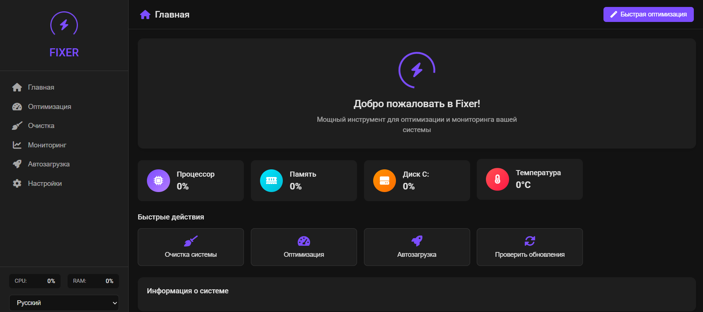
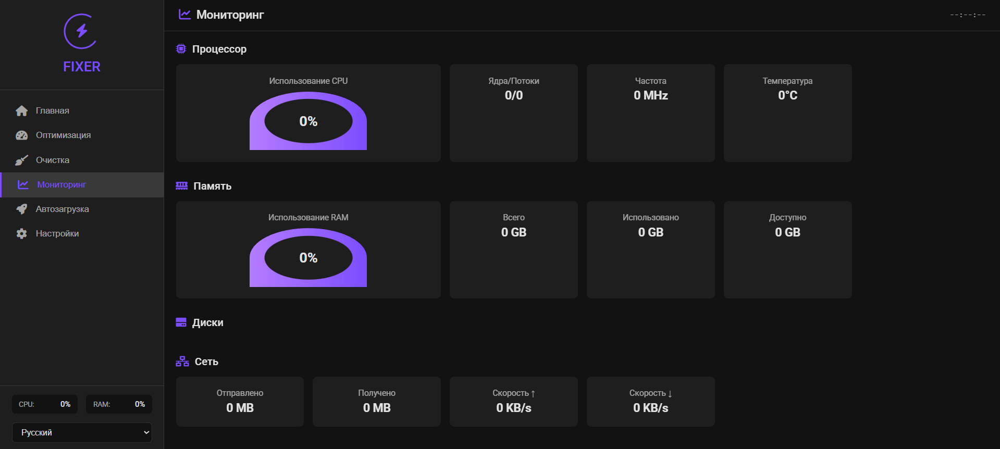

# Fixer by Zumfyyyk

**Fixer** — это современное приложение для оптимизации, очистки и мониторинга Windows-системы с удобным графическим интерфейсом.

**Версия: v1.0**

## Возможности

- Мониторинг ресурсов (CPU, RAM, диски, сеть, температура, GPU)
- Очистка кэша популярных приложений (Chrome, Firefox, Edge, Discord и др.)
- Быстрая очистка системы и корзины
- Управление автозагрузкой программ
- Оптимизация служб Windows и брандмауэра
- Переключение темы (тёмная/светлая)
- Многоязычный интерфейс (русский, английский)
- Проверка обновлений

## Установка

1. **Склонируйте репозиторий:**

   ```
   git clone https://github.com/zumfyyyk/fixer.git
   cd fixer
   ```

2. **Установите зависимости:**

   ```
   pip install -r requirements.txt
   ```

3. **(Рекомендуется) Запустите от имени администратора!**

## Запуск

```bash
python main.py
```

Приложение откроется в окне браузера (Chrome). Для работы некоторых функций (очистка корзины, служб, автозагрузка) требуются права администратора.

## Структура проекта

- `main.py` — основной backend на Python (Eel)
- `web/` — frontend (HTML/CSS/JS)
- `config.json` — настройки пользователя
- `logs/` — логи работы приложения

## Скриншоты




## Лицензия

MIT

---

**Автор:** [Zumfyyyk](https://github.com/zumfyyyk)
